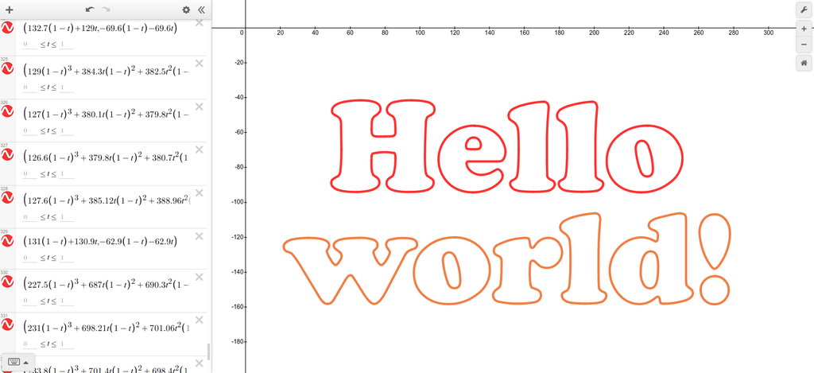
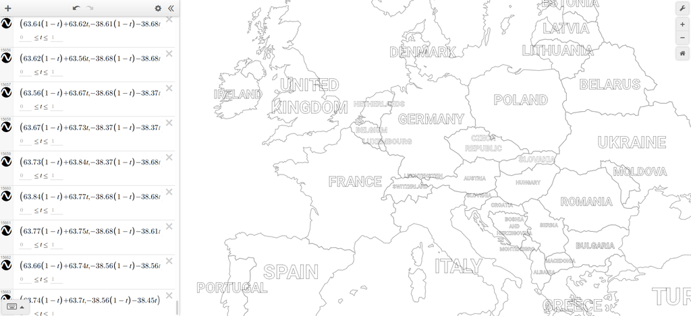

## SVG to equations
This is a small utility used to convert SVG paths to mathematical equations.
The equations can then be plotted to recreate the image. This only allows outlining
SVG paths, and not other shapes, clip paths, patterns or other fancy stuff.
For this reason, every unsupported element must be converted to a path using a
vector editor like Inkscape, or an optimizer like SVGO.

This was primarily aimed to be used with [Desmos](https://www.desmos.com/calculator).
Equations with latex formatting can be copy-pasted directly in the calculator, and it
is possible to generate a script used to set some basic styling on equations.





Jar files can be found under [releases](https://github.com/maltaisn/svg-equations/releases).

### Usage
The jar file can be run with:
```text
java -jar svgeq.jar <svg-file> [options]
```
The CLI expects at least one parameter specifying the `.svg` file, but there can be more than one.

#### Options
- **-s**, **--style**: Whether to output a script that can used to set the style for Desmos.
The supported styles are stroke color, opacity and width. Default: false.
- **-p**, **--precision**: Number of decimals in the generated equations. Default: 2.
- **-e**, **--equations**: Equations type, one of: parametric, cartesian.
- **-t**, **--transform**: Transformations applied on the whole SVG.
- **-x**, **--latex**: Whether to format output as latex equations or not. Default: false.
- **-l**, **--lenient**: Set this option to enable lenient mode and ignore non-fatal parsing errors.
- **--width-mult**: If generating the style script, the multiplier used on line width, for adjustment. Default: 1.
- **-h**, **--help**: Show the help message.

Transformations use [SVG grammar](https://developer.mozilla.org/en-US/docs/Web/SVG/Attribute/transform) for 
the `transform` attribute. The Y axis is always automatically inverted. Arcs are always converted to bezier curves.

Here's an example usage of options:
```text
-p 3 -e parametric --transform="translate(10 10) rotate(30) skewX(10)" --latex --lenient
```

If using the style script, the stroke width will most likely have to be tuned manually.
This is because Desmos doesn't have an absolute stroke width, but rather the width is kept the same for
all zoom levels. Therefore, the width must be adjusted for whatever zoom level will be used to view.
Also note that the script can only set widths ranging from 0.1 to 25.5.

#### Current limitations
- The only supported tag is `path`, and the only supported attributes are `d`, `transform`, `opacity`,
`stroke-opacity`, `stroke` and `stroke-width`. Make sure to manually check your SVG file content before
generating the equations. Notably, there shouldn't be any groups in the SVG structure.
- Cartesian equation type only supports straight lines. Cartesian equations
for bezier curves are [theoretically possible](https://math.stackexchange.com/a/438759/515717) but not simple,
and performance when plotted would be bad. Also see #1.

## Changelog
See [changelog](CHANGELOG.md).

## License
All code is licensed under [Apache License, Version 2.0](LICENSE).
